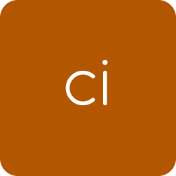
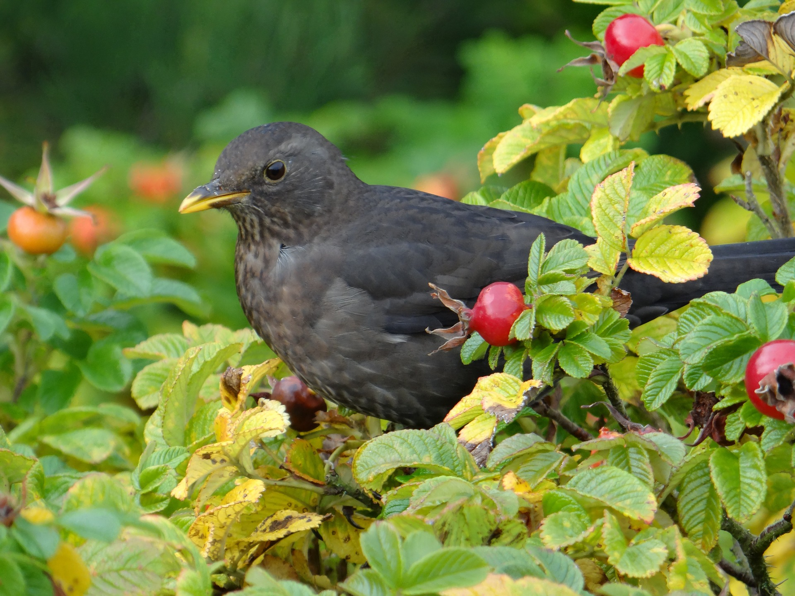
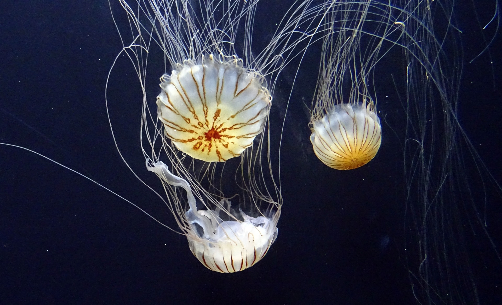

apeman-asset-images
==========

<!---
This file is generated by ape-tmpl. Do not update manually.
--->

<!-- Badge Start -->
<a name="badges"></a>

[![Build Status][bd_travis_shield_url]][bd_travis_url]
[![Code Climate][bd_codeclimate_shield_url]][bd_codeclimate_url]
[![Code Coverage][bd_codeclimate_coverage_shield_url]][bd_codeclimate_url]
[![npm Version][bd_npm_shield_url]][bd_npm_url]
[![JS Standard][bd_standard_shield_url]][bd_standard_url]

[bd_repo_url]: https://github.com/apeman-asset-labo/apeman-asset-images
[bd_travis_url]: http://travis-ci.org/apeman-asset-labo/apeman-asset-images
[bd_travis_shield_url]: http://img.shields.io/travis/apeman-asset-labo/apeman-asset-images.svg?style=flat
[bd_travis_com_url]: http://travis-ci.com/apeman-asset-labo/apeman-asset-images
[bd_travis_com_shield_url]: https://api.travis-ci.com/apeman-asset-labo/apeman-asset-images.svg?token=
[bd_license_url]: https://github.com/apeman-asset-labo/apeman-asset-images/blob/master/LICENSE
[bd_codeclimate_url]: http://codeclimate.com/github/apeman-asset-labo/apeman-asset-images
[bd_codeclimate_shield_url]: http://img.shields.io/codeclimate/github/apeman-asset-labo/apeman-asset-images.svg?style=flat
[bd_codeclimate_coverage_shield_url]: http://img.shields.io/codeclimate/coverage/github/apeman-asset-labo/apeman-asset-images.svg?style=flat
[bd_gemnasium_url]: https://gemnasium.com/apeman-asset-labo/apeman-asset-images
[bd_gemnasium_shield_url]: https://gemnasium.com/apeman-asset-labo/apeman-asset-images.svg
[bd_npm_url]: http://www.npmjs.org/package/apeman-asset-images
[bd_npm_shield_url]: http://img.shields.io/npm/v/apeman-asset-images.svg?style=flat
[bd_standard_url]: http://standardjs.com/
[bd_standard_shield_url]: https://img.shields.io/badge/code%20style-standard-brightgreen.svg

<!-- Badge End -->


<!-- Description Start -->
<a name="description"></a>

Images assets for apeman.

<!-- Description End -->


<!-- Overview Start -->
<a name="overview"></a>


<!-- Overview End -->


<!-- Sections Start -->
<a name="sections"></a>

<!-- Section from "doc/guides/01.Installation.md.hbs" Start -->

<a name="section-doc-guides-01-installation-md"></a>

Installation
-----

```bash
$ npm install apeman-asset-images --save
```


<!-- Section from "doc/guides/01.Installation.md.hbs" End -->

<!-- Section from "doc/guides/02.Favicons.md.hbs" Start -->

<a name="section-doc-guides-02-favicons-md"></a>

Favicons
--------

| Image | Path |
| :---: | ---- |
|  | [dist/favicon/apeman-favicon.png](dist/favicon/apeman-favicon.png) |
|  | [dist/favicon/tmpl-favicon.png](dist/favicon/tmpl-favicon.png) |
|  | [dist/favicon/asset-favicon.png](dist/favicon/asset-favicon.png) |
|  | [dist/favicon/brws-favicon.png](dist/favicon/brws-favicon.png) |
|  | [dist/favicon/bud-favicon.png](dist/favicon/bud-favicon.png) |
|  | [dist/favicon/cmd-favicon.png](dist/favicon/cmd-favicon.png) |
|  | [dist/favicon/crwl-favicon.png](dist/favicon/crwl-favicon.png) |
|  | [dist/favicon/demo-favicon.png](dist/favicon/demo-favicon.png) |
|  | [dist/favicon/dply-favicon.png](dist/favicon/dply-favicon.png) |
|  | [dist/favicon/mdlw-favicon.png](dist/favicon/mdlw-favicon.png) |
|  | [dist/favicon/task-favicon.png](dist/favicon/task-favicon.png) |
|  | [dist/favicon/app-favicon.png](dist/favicon/app-favicon.png) |
|  | [dist/favicon/srvc-favicon.png](dist/favicon/srvc-favicon.png) |
|  | [dist/favicon/service-favicon.png](dist/favicon/service-favicon.png) |
|  | [dist/favicon/middleware-favicon.png](dist/favicon/middleware-favicon.png) |
|  | [dist/favicon/mock-favicon.png](dist/favicon/mock-favicon.png) |
|  | [dist/favicon/proto-favicon.png](dist/favicon/proto-favicon.png) |
|  | [dist/favicon/react-favicon.png](dist/favicon/react-favicon.png) |
|  | [dist/favicon/scff-favicon.png](dist/favicon/scff-favicon.png) |
|  | [dist/favicon/members/test-favicon.png](dist/favicon/members/test-favicon.png) |
|  | [dist/favicon/members/own-favicon.png](dist/favicon/members/own-favicon.png) |
|  | [dist/favicon/members/ci-favicon.png](dist/favicon/members/ci-favicon.png) |
|  | [dist/favicon/members/dev-favicon.png](dist/favicon/members/dev-favicon.png) |


<!-- Section from "doc/guides/02.Favicons.md.hbs" End -->

<!-- Section from "doc/guides/03.Banners.md.hbs" Start -->

<a name="section-doc-guides-03-banners-md"></a>

Banners
--------

| Image | Path |
| :---: | ---- |
|  | [dist/banner/apeman-demo-banner.png](dist/banner/apeman-demo-banner.png) |
|  | [dist/banner/apeman-app-banner.png](dist/banner/apeman-app-banner.png) |
|  | [dist/banner/apeman-banner.png](dist/banner/apeman-banner.png) |
|  | [dist/banner/apeman-brws-banner.png](dist/banner/apeman-brws-banner.png) |
|  | [dist/banner/apeman-bud-banner.png](dist/banner/apeman-bud-banner.png) |
|  | [dist/banner/apeman-cmd-banner.png](dist/banner/apeman-cmd-banner.png) |
|  | [dist/banner/apeman-crwl-banner.png](dist/banner/apeman-crwl-banner.png) |
|  | [dist/banner/apeman-asset-banner.png](dist/banner/apeman-asset-banner.png) |
|  | [dist/banner/apeman-dply-banner.png](dist/banner/apeman-dply-banner.png) |
|  | [dist/banner/apeman-proto-banner.png](dist/banner/apeman-proto-banner.png) |
|  | [dist/banner/apeman-react-banner.png](dist/banner/apeman-react-banner.png) |
|  | [dist/banner/apeman-scff-banner.png](dist/banner/apeman-scff-banner.png) |
|  | [dist/banner/apeman-task-banner.png](dist/banner/apeman-task-banner.png) |
|  | [dist/banner/apeman-tmpl-banner.png](dist/banner/apeman-tmpl-banner.png) |


<!-- Section from "doc/guides/03.Banners.md.hbs" End -->

<!-- Section from "doc/guides/04.Dummies.md.hbs" Start -->

<a name="section-doc-guides-04-dummies-md"></a>

Dummies
--------

| Image | Path |
| :---: | ---- |
|  | [dist/dummy/08.jpg](dist/dummy/08.jpg) |
|  | [dist/dummy/00.jpg](dist/dummy/00.jpg) |
|  | [dist/dummy/02.jpg](dist/dummy/02.jpg) |
|  | [dist/dummy/03.jpg](dist/dummy/03.jpg) |
|  | [dist/dummy/04.jpg](dist/dummy/04.jpg) |
|  | [dist/dummy/05.jpg](dist/dummy/05.jpg) |
|  | [dist/dummy/06.jpg](dist/dummy/06.jpg) |
|  | [dist/dummy/07.jpg](dist/dummy/07.jpg) |
|  | [dist/dummy/01.jpg](dist/dummy/01.jpg) |
|  | [dist/dummy/09.jpg](dist/dummy/09.jpg) |
|  | [dist/dummy/10.jpg](dist/dummy/10.jpg) |
|  | [dist/dummy/11.jpg](dist/dummy/11.jpg) |
|  | [dist/dummy/12.jpg](dist/dummy/12.jpg) |
|  | [dist/dummy/13.jpg](dist/dummy/13.jpg) |
|  | [dist/dummy/14.jpg](dist/dummy/14.jpg) |
|  | [dist/dummy/15.jpg](dist/dummy/15.jpg) |

[pixabay_url]: https://pixabay.com

<!-- Section from "doc/guides/04.Dummies.md.hbs" End -->

<!-- Section from "doc/guides/05.Vendors.md.hbs" Start -->

<a name="section-doc-guides-05-vendors-md"></a>

Vendors
--------

| Image | Path |
| :---: | ---- |
|  | [dist/vendor/docker-dark.png](dist/vendor/docker-dark.png) |
|  | [dist/vendor/docker.png](dist/vendor/docker.png) |
|  | [dist/vendor/nginx.png](dist/vendor/nginx.png) |
|  | [dist/vendor/nodejs-dark.png](dist/vendor/nodejs-dark.png) |
|  | [dist/vendor/nodejs.png](dist/vendor/nodejs.png) |

[pixabay_url]: https://pixabay.com

<!-- Section from "doc/guides/05.Vendors.md.hbs" End -->


<!-- Sections Start -->


<!-- LICENSE Start -->
<a name="license"></a>

License
-------
This software is released under the [MIT License](https://github.com/apeman-asset-labo/apeman-asset-images/blob/master/LICENSE).

<!-- LICENSE End -->


<!-- Links Start -->
<a name="links"></a>

Links
------

+ [apeman][apeman_url]
+ [apeman-asset-labo][apeman_asset_labo_url]
+ [pixabay][pixabay_url]

[apeman_url]: https://github.com/apeman-labo/apeman
[apeman_asset_labo_url]: https://github.com/apeman-asset-labo
[pixabay_url]: https://pixabay.com

<!-- Links End -->
